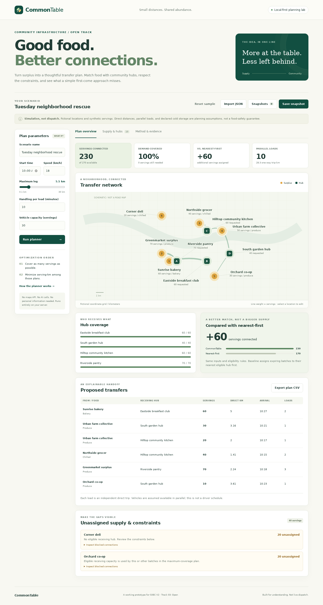

# CommonTable

**Good food. Better connections.** An explainable, local-first planning lab for community food-surplus transfers, built for [Global Innovation Build Challenge V2](https://gibc-v2.devpost.com/), **Track 03: Open (General Technical Invention)**.

CommonTable turns declared food batches and receiving-hub needs into an integer transfer plan. It maximizes assigned servings, then minimizes serving-kilometers, while respecting compatibility, capacity, expiry, opening windows and direct-leg distance. A nearest-first comparison and a pair-by-pair audit show why the result differs from a simpler approach.

**This is a simulation, not dispatch software.** All included names, coordinates and quantities are synthetic. No real beneficiaries, food deliveries, empirical impact results or food-safety guarantees are represented.



## Run locally

**Prerequisite:** Python 3.11 or later with SQLite support. There are **no Python packages, API keys, accounts, external datasets or runtime network dependencies** to install.

```bash
python3 app.py --host 0.0.0.0 --port 8764
```

Open **http://localhost:8764**. The lightweight health endpoint is **http://localhost:8764/health**. Stop with Ctrl+C.

Runtime data is stored in `.runtime/commontable.sqlite3`, not in source files. Optional process settings:

```bash
APP_DATA_DIR=.runtime PORT=8764 python3 app.py
```

`PORT` defaults to `8764`; `APP_DATA_DIR` defaults to `.runtime`. `.env.example` documents these settings; the application does not execute or automatically load `.env` files. The HTTP server binds to all interfaces by default; use `--host 127.0.0.1` for loopback-only access.

## Try the complete flow

1. The sample loads automatically: six batches, four hubs, and a computed network.
2. In **Supply & hubs**, add, edit or remove fictional batches and hubs. A stale-results warning remains until **Run planner** recomputes the plan.
3. Change **Maximum leg** from 5.5 km to 2 km. Coverage drops from 230 to 120 servings; inspect unassigned supply and **Method & evidence** for the reasons. On narrow screens, use **Adjust plan parameters**.
4. **Save snapshot**, then load it from **Snapshots**, including after a page reload. Saving stores inputs, not opaque recommendations; loading recomputes the plan.
5. **Export scenario JSON** for portable inputs; import the file to reproduce a plan. **Export plan CSV** downloads the current, non-stale handoffs. Snapshot deletion does not delete the working scenario.

Snapshots are scoped to an anonymous HttpOnly, SameSite=Strict browser cookie, capped at 25 per session and 1,000 per server. They expire after seven days and are physically removed on the next save. Clearing cookies loses access; these are not accounts. Use only synthetic/non-sensitive data, and use JSON exports for durable copies.

## Measured fixture results

These numbers describe the bundled synthetic fixture, **not real-world performance**:

| Metric | CommonTable | Expiry-ordered nearest-first |
|---|---:|---:|
| Available servings | 270 | 270 |
| Declared demand | 230 | 230 |
| Assigned servings | **230** | 170 |
| Demand coverage | **100%** | 73.9% |
| Unassigned supply | 40 | 100 |
| Serving-km | 684.000 | 309.840 |
| Independent parallel loads | 10 | 8 |
| One-way trip-km | 28.30 | 15.83 |

The bakery can serve the flexible pantry or the bakery-only breakfast club. Nearest-first fills the pantry with bakery food, leaving produce without enough compatible capacity. CommonTable sends bakery food to the breakfast club and produce to the pantry, assigning **60 additional servings**. Covering more demand in this example requires **more distance**, not less; no emissions reduction is claimed.

At a 2 km direct-leg limit, CommonTable assigns **120 servings (52.2% demand coverage)**. The two scenarios demonstrate sensitivity to constraints, not a general guarantee of a 60-serving improvement. On some inputs the baseline is already optimal.

## Method and assumptions

`planner.py` validates the full input schema, constructs eligible donor-to-hub arcs, and solves a min-cost maximum-flow problem:

```text
source --batch quantity--> batch --eligible transfer--> hub --min(demand, capacity)--> sink
```

The custom implementation uses successive shortest augmenting paths, Dijkstra with reduced-cost potentials, and residual reverse edges. It augments until no source-to-sink path remains. Therefore it first maximizes integer servings, and, among those maximum-flow plans, minimizes integer serving-meter cost. Sorting location IDs provides deterministic tie behavior; it does not provide a fairness policy. Standard min-cost flow is not claimed as a new algorithm.

An arc is eligible only if the hub accepts the batch category, has cold storage for chilled food, has positive demand/capacity, is within the distance limit, and can receive the batch before both expiry and closing:

```text
distance = Euclidean distance in the fictional kilometer grid
travel = ceil(distance / speed_kph * 60)
duration = travel + handling_minutes
departure = max(start_minute, ready_minute, hub_open_minute - duration)
arrival = departure + duration
arrival <= batch_expiry AND arrival <= hub_close
```

Waiting for a hub to open is allowed. Arrival exactly at expiry/closing and a leg exactly at the distance limit are allowed. Windows are same-day integer minutes, `0..1439`. Distances for cost are rounded to the nearest meter; Python's ties-to-even rounding applies. Eligibility uses the unrounded distance. Coordinates share the same scale on the schematic; dense labels can be omitted, with full names available through node titles and tables.

The baseline uses the **same eligible arcs**, sorts batches by earliest expiry then ID, and greedily fills nearest hubs by rounded-meter distance then ID. The optimizer's assigned servings cannot be worse than that baseline.

**Units and limits:**

- A serving is an abstract interchangeable simulation unit, not a nutrition or meal-equivalence estimate. One batch has one category; hub demand is pooled across its accepted categories.
- Up to **20 batches and 20 hubs**, coordinates `0..20` km, quantity/demand/capacity `0..10,000`, and a **128 KiB** request limit. Zero supply/demand and empty networks are valid. Zero demand reports 0% coverage.
- Speed is `1..100` km/h, handling `0..120` minutes, maximum leg `0.1..30` km, and vehicle capacity `1..1,000` servings.
- **Serving-km** is servings times direct-leg distance, summed across transfers. It is the minimized cost, not distance driven.
- Each transfer needs `ceil(servings / vehicle_capacity)` independent loads. **Trip-km** sums one-way distances for those loads. Loads/trip-km are reported, not minimized. There are no return legs, road maps, multi-stop routes, limited fleet schedules or shared-driver constraints.
- Sufficient parallel vehicles and appropriate transport conditions are assumed. Declared cold storage is not verified. Allergens, handling practices, actual road travel, food safety, volunteer consent and operational availability are outside scope.
- Maximizing aggregate coverage does not guarantee equitable per-hub outcomes. Hub-level gaps stay visible.

## Verification and build

The backend suite has **24 tests**, including **180 exhaustive 2-by-2 integer-oracle cases**, a 20-by-20 conservation case, the exact sample/baseline result, time/distance boundaries, invalid inputs, CSV formula neutralization, snapshot expiry/limits, HTTP endpoints and cross-session isolation.

```bash
python3 -m unittest discover -s tests -v
```

Optional real-browser verification requires **Node.js 20+** and workspace-local development packages:

```bash
npm ci
PLAYWRIGHT_BROWSERS_PATH=./node_modules/.cache/ms-playwright npx playwright install chromium
node scripts/browser-check.mjs
```

On a minimal **ARM64/AMD64 Linux with glibc 2.36+**, if Chromium reports missing libraries, this optional helper downloads and extracts the needed Debian libraries and test fonts into `node_modules/.cache`, without root or system changes:

```bash
python3 scripts/install-browser-libs.py
node scripts/browser-check.mjs
```

That helper needs internet access, `dpkg-deb`, and Python's `lzma` support. It verifies package archive SHA-256 values against the HTTPS-fetched Debian package index; it is not an independent signature-verification implementation. On other operating systems use Playwright's platform prerequisites. These libraries are only for development evidence; the application itself needs none of them.

Browser verification exercises rendered metrics, all three views, batch/hub editing and creation/removal, stale-result guards, snapshot save/reload/isolation/deletion, CSV/JSON downloads, import rejection, HTML-as-text rendering, the distance what-if, mobile sizing and zero external application requests. It captures four actual screenshots in `docs/media/`.

Build a portable archive and smoke-test the **extracted application**, including health, static assets and the exact allocation result:

```bash
python3 scripts/build.py
```

The archive is `.runtime/build/commontable-1.0.0.zip` (or under `APP_DATA_DIR`). It contains application/development sources, documentation and media, with a SHA-256 manifest. It excludes runtime databases, credentials and dependencies. No compilation step is needed for the Python/JavaScript application.

Each HTTP verification command temporarily owns **port 8764**, refuses an already occupied port where applicable, and shuts down its own server. Run these commands sequentially without a separately running app on that port. Test databases and browser profiles are temporary and kept under `APP_DATA_DIR`.

## Demo and screenshots

The [captioned demo recording](docs/media/commontable-demo.webm) shows actual application interactions in English subtitles, at 1440 x 1000 resolution. It is approximately **2 minutes 38 seconds**, not a slideshow or a mockup. A hosted video URL is not bundled.

See [the media guide](docs/MEDIA.md) for screenshots and the recording sequence. To regenerate:

```bash
node scripts/browser-check.mjs
node scripts/record-demo.mjs
python3 scripts/verify_media.py
node scripts/check-video.mjs
```

The recording takes about three minutes. Media verification parses PNG dimensions and WebM metadata and enforces the **120-300 second** video duration bound. The video check also uses Chromium to decode three nonblank, distinct frames at 5, 75 and 150 seconds.

## API

All write requests use `Content-Type: application/json`. Validation errors are `422 {"error":"..."}`; malformed JSON is 400, oversized requests 413, unsupported media 415, cross-origin access 403, and missing snapshots 404. Storage failures are explicitly returned as 503 and logged. Unknown object fields are rejected.

| Method | Path | Behavior |
|---|---|---|
| GET | `/health` | Lightweight process health |
| GET | `/api/demo` | Original synthetic scenario |
| POST | `/api/plan` | Scenario object in, allocation/metrics/diagnostics out |
| POST | `/api/export/csv` | Scenario object in, spreadsheet-safe handoffs out |
| GET | `/api/scenarios` | List snapshots for the browser cookie; initializes a session |
| POST | `/api/scenarios` | Validate and save a scenario; returns ID/name/creation time |
| GET | `/api/scenarios/{id}` | Load an owned, unexpired scenario |
| DELETE | `/api/scenarios/{id}` | Delete an owned scenario |

Use `data/demo.json` as the complete schema example. The plan result contains `version`, `summary`, `baseline`, `improvement`, `transfers`, per-donor/per-hub diagnostics, `pairs` and `reason_labels`. All quantities are integers; output is strict JSON without NaN or Infinity. The API accepts raw scenario objects, not a wrapper with a `scenario` property.

## Architecture and boundaries

```text
web/                         Static HTML, CSS, JavaScript and SVG interface
app.py                       Same-origin HTTP API and explicit static-file allowlist
planner.py                   Validation, eligibility, optimizer, baseline, CSV
store.py                     Bounded, cookie-scoped SQLite snapshots
data/demo.json               Original synthetic fixture
tests/                       Standard-library behavioral tests
scripts/                     Build, scoped browser checks, recording, media validation
```

User-supplied names are rendered as text, not HTML or executable instructions. Imports use JSON parsing plus server-side validation. The server has no shell execution, remote fetch or LLM pathway. CSV cells with formula prefixes are neutralized. SQL uses parameters; filesystem URLs are an explicit allowlist. Responses include restrictive CSP, frame denial, no-store caching and no cross-origin API support.

This is a small research/planning prototype using Python's standard-library HTTP server, **not a hardened production service**. There is no real user authentication, encrypted SQLite storage, distributed rate limiting, disaster recovery or field validation. Anonymous session cookies are access capabilities, not an appropriate protection for personal information. Public operation would require an appropriate HTTPS boundary and operational review. Do not put real beneficiary records or sensitive food-operation data into it.

## Built with, credits and AI disclosure

Python 3.11 (standard-library `http.server`, `sqlite3`, `heapq`, `math`, `csv`, `unittest`, and packaging utilities), SQLite, JavaScript ES modules, HTML5, CSS, SVG, Node.js 22, npm, Playwright 1.58.2, Chromium 145 and Playwright's bundled FFmpeg. Optional browser-evidence setup uses Debian bookworm shared libraries and DejaVu fonts under their upstream licenses; these are not application dependencies or vendored source assets.

The data fixture, interface, illustrations and allocation implementation were created for this project. **No external dataset, pretrained model, hosted AI inference, maps service or paid API is used.** Code and the synthetic fixture are available under the [MIT license](LICENSE); development dependencies retain their respective licenses.

**AI assistance:** GitHub Copilot CLI, powered by GPT-6 Astra, assisted project design, implementation, test authoring, documentation and demo automation. This is an AI-assisted software build, not an AI model submission. The application performs deterministic optimization and does not call Copilot or another model at runtime. Verification was performed on CPU-only ARM64 Linux with Python 3.11.16 and Node.js 22.23.2; no model was trained.


## Try it out

- [Live application](https://devpost-global-innovation-build-challenge-v2-30408.gilbertcv.com)
- [Public source](https://github.com/gil906/devpost-global-innovation-build-challenge-v2-30408)
